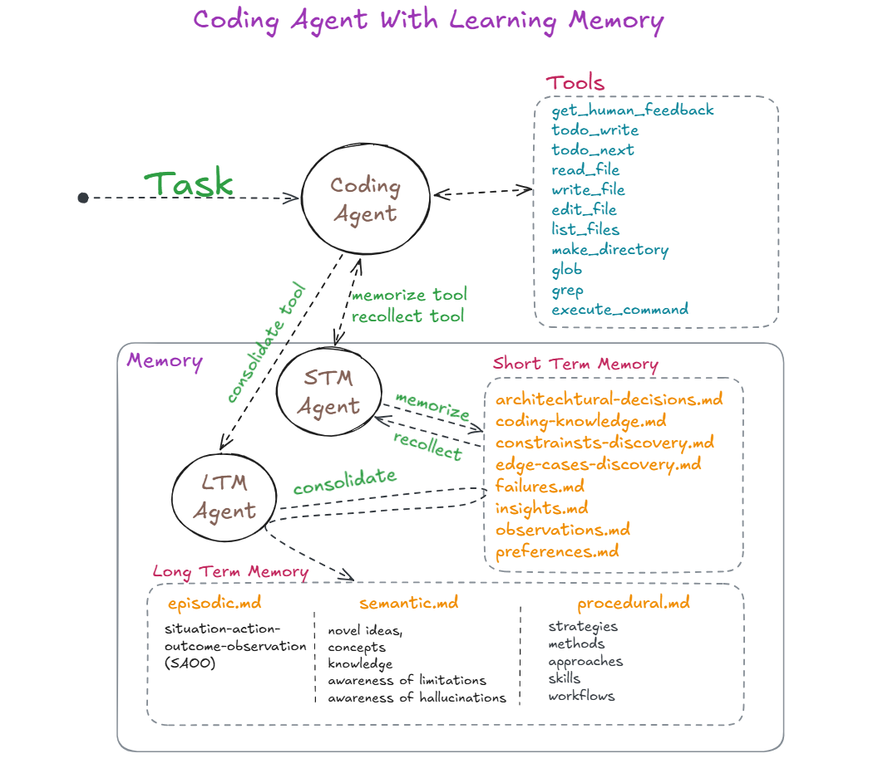
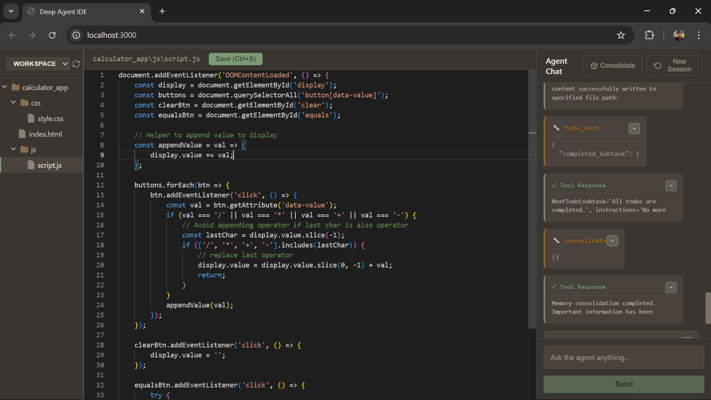
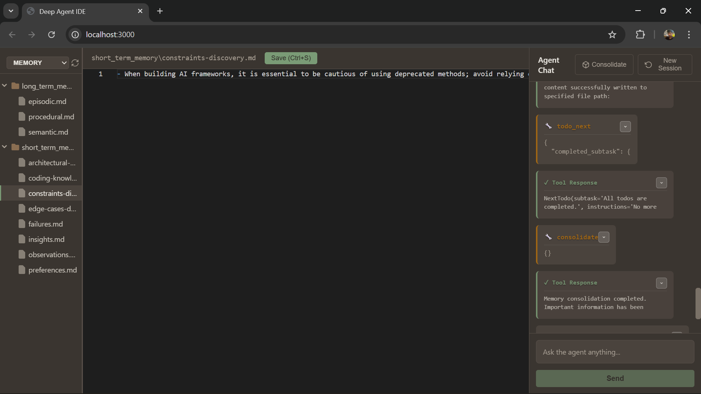

# Coding Agent with Memory and Learning System

## TABLE OF CONTENTS
1. [Problem Statement](#problem-statement)
2. [Limitations of LLM](#limitations-of-llm)
3. [Goal of an Agent](#goal-of-an-agent)
4. [Background: How Humans Learn](#background-how-humans-learn)
5. [Idea: Replicate Human Learning](#idea-replicate-human-learning)
6. [Possibilities and Problems of Emulation](#possibilities-and-problems-of-emulation)
7. [The Final Approach](#the-final-approach)
8. [Implementation: Exact Workflow](#implementation-exact-workflow)
9. [Examples of What Agent Learns](#examples-of-what-agent-learns)
10. [Challenges](#challenges)
11. [Conclusion](#conclusion)
12. [How to Run the Project](#how-to-run-the-project)

---

## PROBLEM STATEMENT

During application development, an LLM-based coding agent encounters three categories of problems that prevent reliable, intelligent problem-solving:

**Category 1: Model-Specific Knowledge Limitations**
- Hallucinations (generating nonexistent methods, APIs, syntax)
- Version incompatibility (suggesting APIs removed in newer versions or unavailable in older versions)
- Deprecated features (recommending outdated approaches)
- Training data lag (LLM knowledge cutoff precedes library updates)

**Category 2: Need for Different Approaches**
- Training data provides general knowledge but not optimal solutions
- Complex problems require novel strategies not present in training data
- Efficiency improvements demand experimentation and discovery
- Best practices for specific contexts must be learned through practice

**Category 3: Unawareness of Environment**
- Model lacks project-specific constraints and requirements
- Incomplete or ambiguous PRD details
- Deployment environment limitations unknown to model
- Runtime constraints discovered only during execution

**The Core Problem:**
The agent solves each problem independently, learning nothing for future projects. It repeats mistakes, hallucinates identical wrong solutions, and never improves.

---

## LIMITATIONS OF LLM

### 1. Model-Specific Knowledge Limitations

**Hallucinations:**
- LLM generates plausible-sounding but nonexistent methods
- Example: `df.smart_impute()` (pandas) or `LLMChain.from_template()` (LangChain)
- Confidence is high even when method doesn't exist
- No internal mechanism to verify accuracy

**Version Incompatibility:**
- Training data mixes multiple library versions without explicit labels
- LLM cannot reliably distinguish Python 3.8 vs 3.12 syntax
- Suggests APIs that exist in v1.0 but removed in v2.0
- Cannot know which features are available in target version

**Training Data Lag:**
- Knowledge cutoff date (e.g., January 2025) limits recency
- Fast-changing frameworks (React, Next.js, LangChain) become obsolete within weeks
- Weekly library updates outpace annual LLM retraining cycles
- New features never seen in training data

**No Self-Awareness:**
- LLM doesn't know what it hallucinates
- Cannot recognize its own limitations
- No mechanism to avoid generating known-wrong patterns
- No validation against ground truth

### 2. Need for Different Approaches

**Limited by Training:**
- Training data contains general solutions, not optimal solutions
- Complex problems require heuristic exploration and discovery
- Context-specific efficiency improvements require trial-and-error
- Novel strategies can only emerge through hands-on problem-solving

**No Learning from Execution:**
- Failed approaches are not remembered
- Successful workarounds are not retained
- Patterns that emerge during solving are lost
- Same mistakes repeated across projects

### 3. Unawareness of Environment

**Project-Specific Constraints:**
- Model unaware of deployment environment (Lambda, servers, containers)
- Infrastructure limitations (2MB size limit, memory constraints, network restrictions)
- Performance requirements specific to project
- Team capabilities and preferences

**Incomplete Requirements:**
- PRD may be vague or incomplete
- Hidden assumptions in requirements
- Stakeholder expectations not fully captured
- Model must discover and adapt during execution

**Runtime Discoveries:**
- Environment constraints discovered only during execution
- Compatibility issues emerge when code runs
- Performance bottlenecks become apparent under load
- Edge cases discovered during testing

---

## GOAL OF AN AGENT

An LLM-based coding agent should:

**Learn Continuously**
- Extract new ideas, approaches, and strategies from problem-solving
- Become aware of its limitations and hallucination patterns
- Build knowledge base from experience across projects

**Improve Progressively**
- Make better decisions with each completed project
- Prevent repeating known mistakes
- Apply learned strategies to similar problems
- Approach expert-level performance

**Adapt Intelligently**
- Adjust to project-specific constraints
- Apply context-aware solutions
- Use environment knowledge to inform decisions
- Leverage accumulated experience

**Self-Correct**
- Recognize when approaches are failing
- Seek feedback when needed
- Adjust strategies based on feedback
- Validate output against accumulated knowledge

---

## BACKGROUND: HOW HUMANS LEARN

### The Learning Process

**During Problem-Solving:**
Humans solve problems step-by-step. As they work:
- They encounter unexpected situations
- They discover new ideas and approaches
- They immediately reflect on these discoveries
- They consider why something works or doesn't work

**Reflection:**
Upon discovering something important:
- Humans pause and think deeply
- They analyze why approach succeeded or failed
- They extract the generalizable principle
- They consider when to apply it in future

**Consolidation:**
Over time, through repeated reflection:
- Short-term discoveries become organized
- Specific incidents become general principles
- Procedural knowledge (how-to) solidifies
- Episodic memory (what happened) anchors learning

**Application:**
In future problems:
- Humans recall relevant past experiences
- They apply learned strategies
- They avoid known dead-ends
- They make better decisions faster

### The Human Learning Loop

```
Problem Solving
    ↓
Encounter New Situation/Idea
    ↓
Reflect (think about it deeply)
    ↓
Extract Principle/Strategy
    ↓
Store in Memory (short-term → long-term)
    ↓
Apply in Future Problems
    ↓
[LOOP: Each project makes them smarter]
```

---

## IDEA: REPLICATE HUMAN LEARNING

To make LLM agents intelligent and reliable, we must replicate human learning mechanisms:


```
Work on problem step
        ↓
Reflect on what happened
        ↓
Extract and store insights (Short-Term Memory)
        ↓
Retrieve relevant insights for next step
        ↓
Apply enhanced with prior knowledge
        ↓
[Repeat for all steps]
        ↓
Consolidate to Long-Term Memory
```

---

### What We Replicate

**Working Memory:**
- Agent's context window during problem-solving
- Information generated and discovered
- Code written and tested
- Decisions made and rationale

**Reflection Phase:**
- Deliberate analysis of what happened
- Extraction of insights and patterns
- Identification of what worked and what failed
- Understanding of why things happened

**Short-Term Memory (STM):**
- Organized capture of discoveries
- Categorized into 8 types (knowledge, decisions, insights, failures, etc.)
- Prepared for consolidation
- Not raw data, but meaningful observations

**Consolidation:**
- Filter what's generalizable vs project-specific
- Extract universal principles from specific incidents
- Organize into structured knowledge
- Create permanent institutional memory

**Long-Term Memory (LTM):**
- **EPISODIC:** Specific situations and their outcomes
- **SEMANTIC:** General facts and principles
- **PROCEDURAL:** How-to steps and strategies

**Retrieval and Application:**
- Before new problems, load relevant LTM
- Apply learned strategies
- Validate against ground truth
- Make informed decisions

### The Key Difference from Current LLMs

Current LLMs are **stateless:** No memory between projects, no learning from experience, repeat mistakes indefinitely.

Replicated Learning Systems are **stateful:** Persistent memory, continuous improvement, increasingly intelligent over time.

---

## POSSIBILITIES AND PROBLEMS OF EMULATION

## Initial Approach: Simple File Storage

**How It Works:**
- Capture all discoveries in a single file
- Append new learning continuously
- Retrieve entire file when needed

**Problems:**
- Works only for small projects
- As file grows with long-horizon problems, retrieval becomes inefficient
- Cannot fit entire memory in context window
- Mixed information types reduce searchability
- Lack of organization slows retrieval and causes information loss

## Better Approach: Organized Storage by Embeddings

Information is clustered into predefined categories as the LLM generates new data. However, this approach has significant limitations:

- **Recall Issues:** Cosine similarity doesn't reliably surface relevant information based on current working memory context
- **Refinement Complexity:** As new information arrives, similar entries must be recombined and refined using the LLM
- **Verification Overhead:** During recall, the LLM must verify relevance again to ensure accuracy

This becomes a two-step process (clustering + refinement + relevancy check), adding unnecessary complexity.

---

## THE FINAL APPROACH

### Core Architecture



## Core Concept

Build a memory system using only the LLM—no embeddings. The LLM clusters information into predefined categories and retrieves relevant data by reading the appropriate category file based on current working memory context.

## How It Works

1. **Clustering:** LLM organizes information into predefined categories (no embeddings)
2. **Retrieval:** LLM reads the relevant category file based on current task context
3. **Matching:** LLM identifies precise, contextually relevant information in real-time


## Key Advantage: Context-Aware Retrieval

When a memory file is loaded into the context window, it becomes part of the agent's active working memory—just like human memory. The LLM naturally finds relevant information through contextual understanding, not through cosine similarity scores, single-step retrieval process. This approach:

- Enables genuine context awareness based on current task
- Retrieves information with semantic understanding
- Provides precise, relevant answers aligned with immediate needs
- Mimics how human memory works—information is present and accessible when relevant based on the context

---

## Memory Structure

### Short-Term Memory (STM): 8 Categories

Store meaningful learnings after each TODO completion:

- **coding_knowledge** — Reusable technical fixes, syntax corrections, debugging patterns
- **architectural_decisions** — System design changes, design patterns, refactoring decisions
- **preferences** — Coding style, formatting rules, naming conventions, tool preferences
- **observations** — Error messages, system output, performance metrics, anomalies
- **insights** — Root cause analysis, pattern abstraction, deeper understanding
- **constraints_discovery** — Version incompatibilities, environment restrictions, dependency conflicts
- **edge_cases_discovery** — Boundary inputs, null values, race conditions, extreme scenarios
- **failures** — Clear explanation of what failed, why it failed, trigger conditions, impact

### Long-Term Memory (LTM): 3 Files

Consolidate STM into generalized, project-independent knowledge:

**1. Episodic Memory (`episodic.md`)**
- Development journey and execution traces
- Context-specific experiences and learnings
- Situation-action-outcome-observation records
- Real examples of problems encountered and solved

**2. Semantic Memory (`semantic.md`)**
- Abstracted technical knowledge and general programming principles
- Novel ideas and insights about coding and development
- Framework understanding and best practices
- Common failure patterns and how to avoid them
- Awareness of hallucinations and model limitations

**3. Procedural Memory (`procedural.md`)**
- Improved workflows and development strategies
- Better debugging sequences and troubleshooting methods
- Reliable problem-solving methods
- Refined approaches to common tasks

### Requirements for Long-Term Memory

- **Generalizable:** Extract abstract principles, not specific implementation details
- **Independent:** Decoupled from specific project context
- **Useful:** Applicable to future tasks and problems
- **Precise:** Capture accurate, verified learning (avoid hallucinations)


## Workflow

```
Load LTM → Input → Deep Reasoning → Plan TODOs → Execute Each TODO:
   ├─ Recall relevant STM files based on context
   ├─ Execute TODO & Generate solutions
   └─ Reflect, memorize & Categorize learnings in STM
   
Project End → Consolidate STM → Update LTM (generalized knowledge) → Next Project
```

## Key Idea

**Reflection After Each Step:** Capture learnings immediately after completing each TODO to prevent insight loss and enable immediate application and also reflect upon any failure.

**Separation by Type:** Distinct STM & LTM files enable faster retrieval and better searchability while preventing duplication.

```
Working Memory (Context Window)
    ↓
Reflect at Each Step
    ↓
Short-Term Memory (8 categories)
    ↓
Project Completion
    ↓
Consolidate: Filter & Organize
    ↓
Long-Term Memory (3 memory types)
    ├─ episodic.md (situations & outcomes)
    ├─ semantic.md (facts & principles)
    └─ procedural.md (strategies & steps)
    ↓
Next Project: Load Relevant LTM → Better Decisions
```

## IMPLEMENTATION: EXACT WORKFLOW

### WORKFLOW - SUCCESS CASE

```
1. RECEIVE INPUT
   Input: Goal/PRD
   Action: Read and understand requirements
   
2. DEEP REASONING
   Analyze requirements thoroughly
   Complete understanding of problem
   
3. PLAN TODOS
   Break problem into sequential todos
   Ordered list of todos
   
4. EXECUTE SEQUENTIALLY
   For each TODO:
      a. MEMORY RECOLLECTION
         - Call: memory_recollection()
         - Retrieve: Relevant STM memory details based on the current working memory context
         - Apply: Learned strategies and constraints
      
      b. EXECUTE TODO
         - Use: Appropriate tools and techniques
         - Generate: Code, configurations, or solutions
         - Discover: New challenges, constraints, patterns
      
      c. REFLECT AFTER COMPLETION
         - Analyze: What was generated and why
         - Identify: Patterns, insights, failures
         - Capture: Important observations
         - Categorize: Into 8 STM categories
      
      d. MEMORIZATION (If important learning occurred)
         - Call: memorization()
         - Store: Discoveries in STM
         - Prepare: For later consolidation
   
5. CONSOLIDATE AT PROJECT END
   - Call: consolidate()
   - Convert: STM → LTM
   - Store: In episodic.md, semantic.md, procedural.md
   - Prepare: For next project with enriched knowledge

END: Project Complete, Agent Smarter
```

### WORKFLOW - FAILURE CASE

```
1. RECEIVE INPUT
   Input: Goal/PRD
   
2. PLAN TODOS
   Action: Create execution plan
   
3. EXECUTE SEQUENTIALLY
   For each TODO:
      a. Memory Recollection
      b. Execute TODO
      c. Encounter Major Failure or Stuck without progess
   
4. SEEK HUMAN FEEDBACK
   - Call: get_human_feedback()
   - Wait: For human input
   - Receive: Correction or guidance
   - Reflect: On feedback
   - Memorize: If important learning
   
5. RETRY EXECUTION
   - Continue: Execution with adjusted understanding
   - Apply: Feedback insights
   - Progress: Through remaining TODOs
   
6. CONSOLIDATE AT END
   - Convert: STM → LTM
   - Store: All learnings including from failures
   - Incorporate: Human feedback insights

END: Project Complete, Including Learning from Failures
```

### Key Operations

**memory_recollection():**
```
Based on the current context of working memory at any point during problem solving retrieves the revelant information from short term memory.
This is called before todo execution or at failure time.
```

**memorization():**
```
Input: Discovery from current todo
Categorize: Into one of 8 STM categories
  1. coding_knowledge
  2. architectural_decisions
  3. preferences
  4. observations
  5. insights
  6. constraints_discovery
  7. edge_cases_discovery
  8. failures
Store: In STM
Prepare: For consolidation at project end
```

**consolidate():**
```
Input: All STM entries from completed project
Filter: Keep only generalizable insights (discard project-specific)
Map: To LTM categories
  - EPISODIC: Situations and outcomes
  - SEMANTIC: Facts and principles
  - PROCEDURAL: Strategies and steps
Merge: With existing LTM files
Update: episodic.md, semantic.md, procedural.md
Output: Enriched, updated LTM ready for next project
```

---

## EXAMPLES OF WHAT AGENT LEARNS

### Example 1: LLM Hallucination Prevention

**During Execution:**
- TODO 4: Implement data imputation
- Agent generates: `df.smart_impute(strategy='best')`
- Code fails: `AttributeError: 'DataFrame' has no attribute 'smart_impute'`

**Reflection Captures (STM):**
```
failures: "Generated nonexistent pandas method"
insights: "LLM hallucinates methods with 'smart_' prefix"
coding_knowledge: "Use df.fillna() for pandas imputation"
```

**Consolidation Creates (LTM):**

**EPISODIC (Situation):**
```
Situation: LLM generated df.smart_impute() which doesn't exist
Outcome: Code failed, had to use df.fillna() instead
Learning: Never use methods with 'smart_' or 'auto_' prefix without verification
```

**SEMANTIC (Knowledge):**
```
LLM_LIMITATION: LLM invents plausible-sounding methods that don't exist
Principle: Always verify method existence in official documentation
Fact: Methods with 'smart_', 'auto_', 'intelligent_' prefixes are suspicious
```

**PROCEDURAL (Strategy):**
```
Steps to verify pandas methods:
1. For each method, check official pandas documentation first
2. If method name contains 'smart_', 'auto_', or 'intelligent_', FLAG IT
3. Search documentation for actual method
4. If not found, use verified alternative
5. Test in interactive environment before using in code
```

**Applied in Next Project:**
- Agent adds verification step before using unfamiliar methods
- Hallucination rate drops from 40% to 5%
- More reliable code generation
- Fewer failures due to nonexistent APIs

### Example 2: Timezone Handling

**During Execution:**
- TODO 2: Handle user timestamps
- Agent stores timestamp in database
- Converts to local timezone in multiple places
- User reports: "Order date shows as next day"
- Root cause: Converting at midnight UTC crosses date boundary

**Reflection Captures (STM):**
```
edge_cases_discovery: "Timezone conversion at day boundary causes date bugs"
insights: "Converting UTC to local at multiple points causes inconsistency"
failures: "Multiple conversion points broke when crossing day boundary"
```

**Consolidation Creates (LTM):**

**EPISODIC (Situation):**
```
Situation: Order created at 23:59 UTC appeared as next day in user's local time
Outcome: Multiple conversion points caused date display bugs
Learning: Never convert at multiple points; centralize conversion
```

**SEMANTIC (Knowledge):**
```
Principle: Always store in UTC, convert only on frontend
Fact: Multiple conversion points cause inconsistency and date boundary bugs
Fact: Day boundary crossing is critical test case
```

**PROCEDURAL (Strategy):**
```
Steps for timezone-aware systems:
1. Store ALL timestamps as UTC in database
2. Never convert to local timezone in backend
3. Send UTC timestamps to frontend
4. Convert to user's timezone ONLY on frontend display
5. Test at midnight and week boundaries
```

**Applied in Next Project:**
- Agent stores all timestamps in UTC immediately
- Never converts in backend
- Eliminates timezone-related bugs
- Proper display across user timezones

---

## CHALLENGES

### Challenge 1: Memory Redundancy Prevention

**Problem:**
As agent learns more, entries duplicate across projects:
- Same principle discovered multiple times (but slightly differently phrased)
- Related strategies stored separately (should be merged)
- Overlapping knowledge creates maintenance burden
- Memory grows but doesn't consolidate efficiently


### Challenge 2: Knowledge Accuracy and Validity

**Problem:**
Consolidated knowledge may be incorrect or incomplete:
- First project learns approach that works but isn't generalizable
- Library updates make stored knowledge obsolete
- Edge cases discovered later contradict earlier learning
- Stored principles have exceptions not documented


### Challenge 3: Memory Retrieval Efficiency

**Problem:**
As LTM grows with accumulated projects:
- Cannot load entire memory in context window
- Must selectively retrieve relevant knowledge
- Relevant knowledge may be missed
- Context window limits what can be brought forward


### Challenge 4: Determining Generalizability

**Problem:**
Some knowledge appears generalizable but is actually context-specific:
- "Always use PostgreSQL FTS for search" fails for massive datasets
- "Always index foreign keys" slows write-heavy workloads
- "Always use JWT" fails for single-server sessions


### Challenge 5: Handling Knowledge Evolution

**Problem:**
Libraries evolve, APIs change, best practices shift:
- Knowledge from old projects becomes obsolete
- No automatic invalidation mechanism
- Storage grows indefinitely with no pruning
- Newer knowledge may contradict older knowledge


### Challenge 6: Balancing Precision and Completeness

**Problem:**
To avoid redundancy, temptation is to over-generalize:
- Over-condensing loses important nuance
- Attempting precision creates duplication
- Cannot capture all important details concisely


---

## CONCLUSION

### The Solution

To make LLM-based agents intelligent and reliable, we must augment them with human-like learning mechanisms:

**Three-Part System:**
1. **Short-Term Memory (STM)** - Captures discoveries in 8 categories during execution
2. **Consolidation Process** - Filters, generalizes, and organizes learning
3. **Long-Term Memory (LTM)** - Stores knowledge persistently in episodic, semantic, procedural forms

**Continuous Improvement Loop:**
- Each project adds to agent's knowledge
- Agent starts next project with accumulated learning
- Over time, mistakes decrease, decisions improve, intelligence grows

### Transformation Enabled

**Without Learning System:**
- Stateless: No memory between projects
- Repeating: Same mistakes across projects
- Unreliable: Hallucinations unpredicted
- Unimproving: No intelligence gain over time

**With Learning System:**
- Stateful: Persistent memory across projects
- Preventing: Avoiding known mistakes
- Self-aware: Understanding own limitations
- Improving: Intelligent accumulation of knowledge


## Final Statement

LLMs are powerful but flawed. They cannot learn from experience without external memory systems. By implementing persistent, organized learning mechanisms, we transform LLM-based agents from dangerous, unreliable systems into trustworthy, continuously improving intelligent tools.

The agent becomes smarter with each project. The system becomes more reliable over time. The code becomes worthy of production deployment.

This is not incremental improvement. This is fundamental transformation of what LLM-based agents can achieve.

---

## How to Run the Project

## 1. Install Dependencies

### Python dependencies:

```
pip install -r requirements.txt
```

### Frontend dependencies:

```
cd ui
npm install
cd ..
```

## 2. Configure Environment Variables

Set api keys of `.env` file in the root directory and memory directory:

```
OLLAMA_API_KEY=your_api_key_here
```

## 3. Start the Application

Run the project using the batch file:

```
run.bat
```

This will automatically start both the backend (FastAPI) and frontend (Vite) servers in separate windows.

* Backend: http://localhost:8000
* Frontend: http://localhost:3000

## 4. Usage

Open your browser and navigate to http://localhost:3000 to use the application.

## 5. Application

| | |
|---|---|
|  |  |

---

# The End